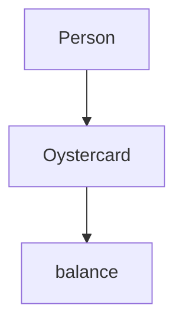
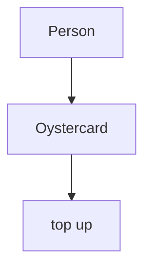
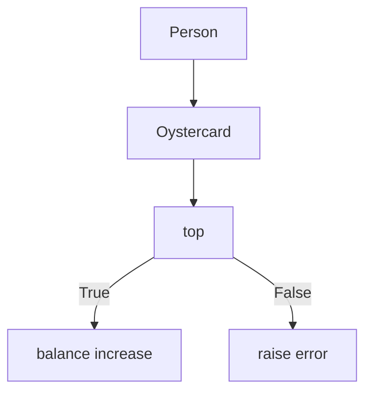
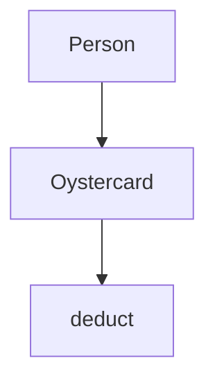
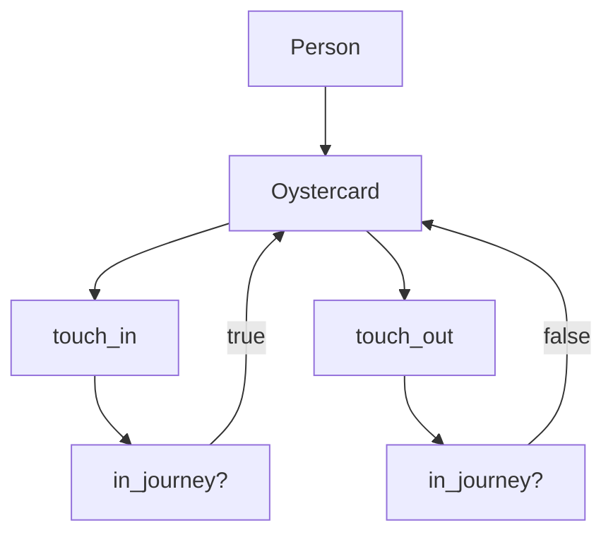
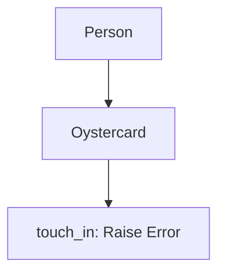
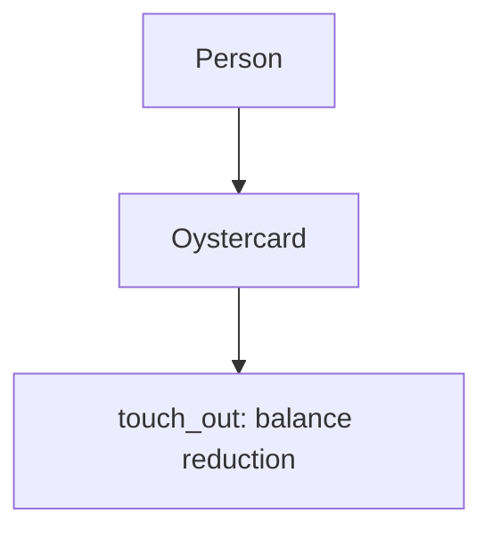
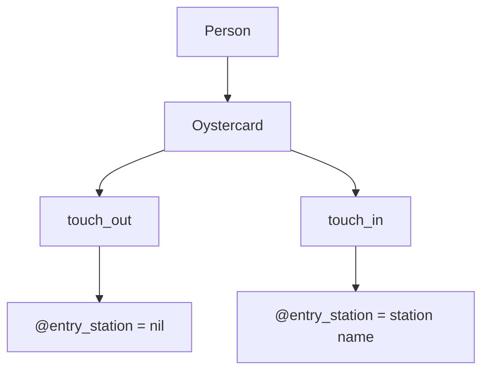
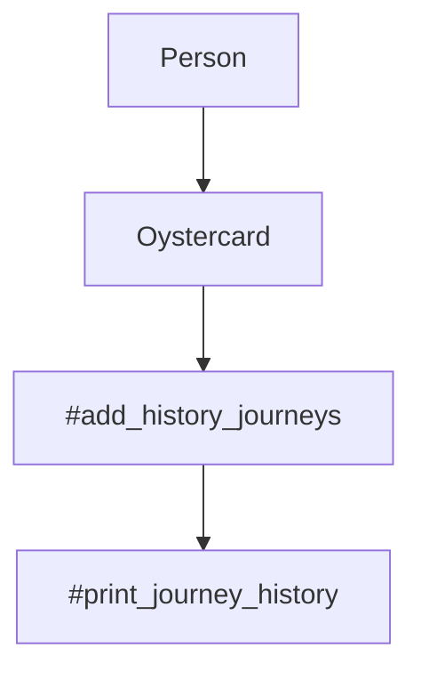
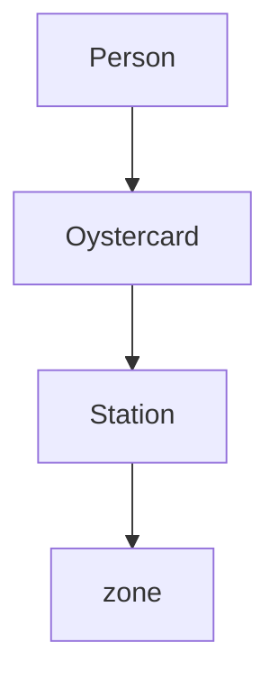

# Oystercard

## Getting started

1) `git clone https://github.com/NBenzineb/Oystercard2.git`

2) Install bundler via `gem install bundle` (if you don't have bundler already)

4) Install dependencies via `bundle`

## Running tests

Run `rspec` from the main directory to test the code and check coverage

## Run

Run code using irb

`require './lib/airport'`

`require './lib/plane'`

## User Stories, Domain Models and Mermaid Diagrams

`In order to use public transport
As a customer
I want money on my card`

|  Objects        |  Messages      |
| ----------      | -------------  | 
| Person  |                        |
| Oystercard  |      balance    |

`In order to keep using public transport
As a customer
I want to add money to my card`

|  Objects        |  Messages      |
| ----------      | -------------  | 
| Person  |                        |
| Oystercard  |      top up    |

`In order to protect my money from theft or loss
As a customer
I want a maximum limit (of £90) on my card

|  Objects        |  Messages      |
| ----------      | -------------  | 
| Person  |                        |
| Oystercard  |      top up   |

`In order to pay for my journey
As a customer
I need my fare deducted from my card`

|  Objects        |  Messages      |
| ----------      | -------------  | 
| Person  |                        |
| Oystercard  |      deduct   |

`In order to get through the barriers.
As a customer
I need to touch in and out.`

|  Objects        |  Messages      |
| ----------      | -------------  | 
| Person  |                        |
| Oystercard  |      touch_in, touch_out, in_journey?   |

`In order to pay for my journey
As a customer
I need to have the minimum amount (£1) for a single journey.`

|  Objects        |  Messages      |
| ----------      | -------------  | 
| Person  |                        |
| Oystercard  |      touch_in      |

`In order to pay for my journey
As a customer
When my journey is complete, I need the correct amount deducted from my card`

|  Objects        |  Messages      |
| ----------      | -------------  | 
| Person  |                        |
| Oystercard  |      touch_out      |

`In order to pay for my journey
As a customer
I need to know where I've travelled from`

|  Objects        |  Messages      |
| ----------      | -------------  | 
| Person  |                        |
| Oystercard  |      touch_out, entry_station      |

'In order to know where I have been
As a customer
I want to see to all my previous trips'

|  Objects        |  Messages      |
| ----------      | -------------  | 
| Person  |                        |
| Oystercard  |  add_journey_history, print_journey_history |

'In order to know how far I have travelled
As a customer
I want to know what zone a station is in'

|  Objects        |  Messages      |
| ----------      | -------------  | 
| Person  |                        |
| Oystercard  |                    |
| Station  |     zone               |

